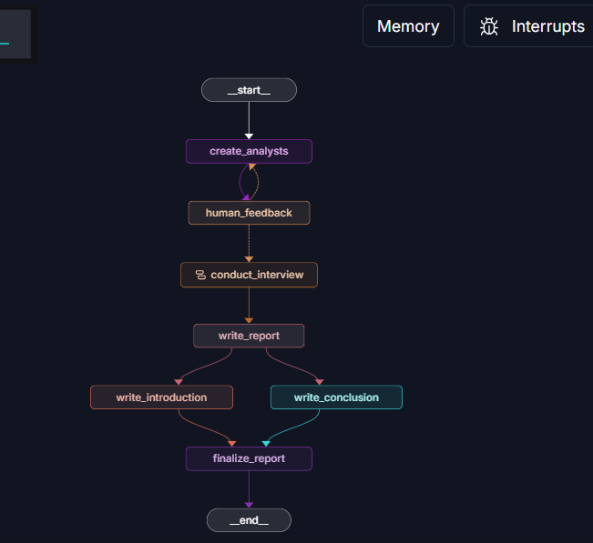

# AI Research Agent

An AI-powered research agent built using **LangGraph** that can break down a research task, create specialized analyst perspectives, perform research, and generate a final answer.

## 🚀 Features

- Multi-agent research workflow
- Built with LangGraph
- Multiple analyst perspectives
- LLM-powered research and analysis
- Web research tools
- State-based agent workflow
- Conditional routing between nodes
- Structured outputs using Pydantic
- State management using TypedDict
- LangSmith integration for tracing and debugging

## 🧠 Architecture

HERE  IS THE IMAGE OF ARCHITECTURE THAT WILL MAKE YOU CLEAR HOW IT WORKS
